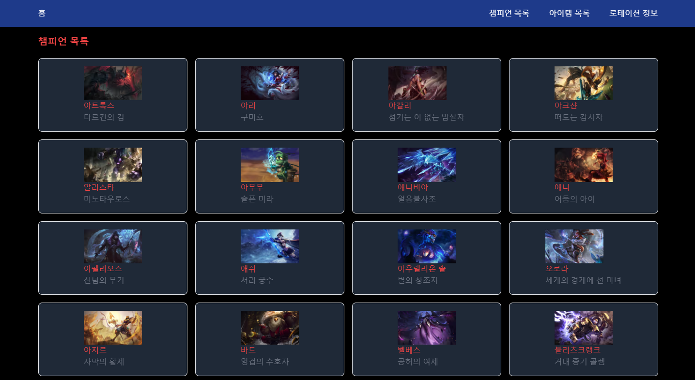
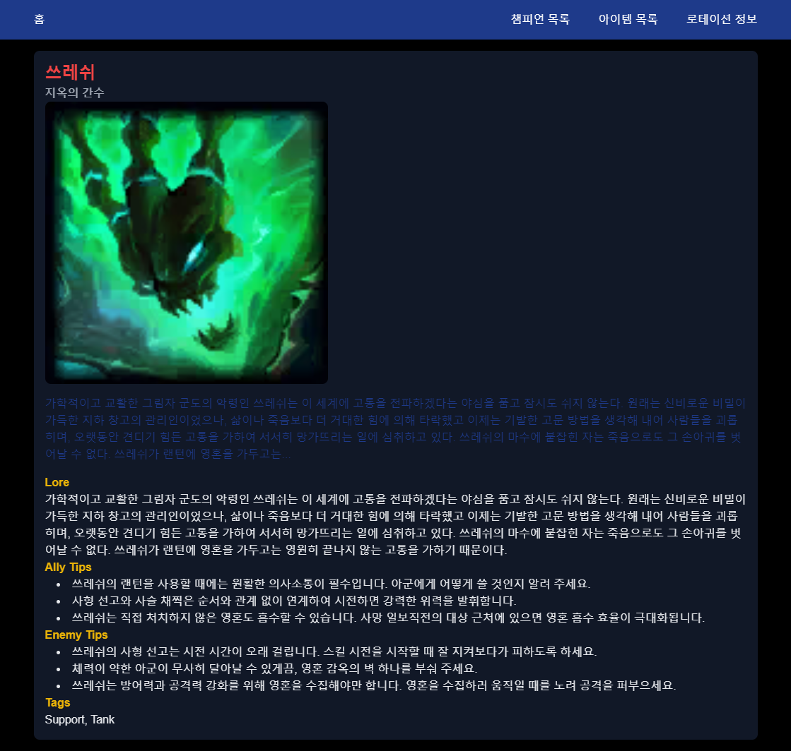
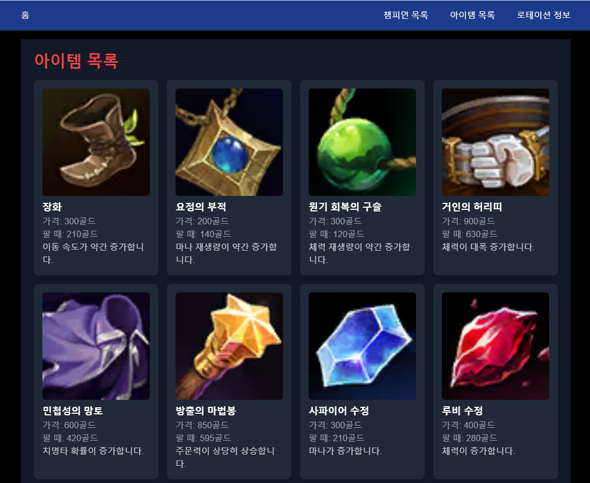
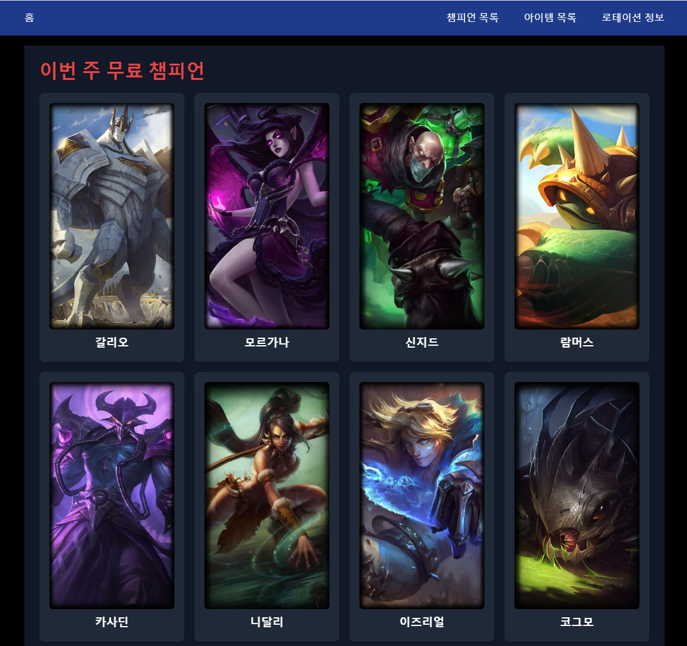

# League of Legends Champion Rotation

## 프로젝트 설명

이 프로젝트는 **League of Legends**의 무료 챔피언 로테이션 정보를 가져와서 표시하는 웹 애플리케이션입니다. 사용자는 현재 무료로 플레이할 수 있는 챔피언 목록을 확인하고 각 챔피언의 상세 정보를 볼 수 있습니다. 또한 게임 내 아이템 목록도 확인할 수 있습니다.

## 프로젝트 구조

📦src
┣ 📂app
┃ ┣ 📂api
┃ ┃ ┗ 📂rotation
┃ ┃ ┃ ┗ 📜route.ts
┃ ┣ 📂champions
┃ ┃ ┣ 📂[id]
┃ ┃ ┃ ┗ 📜page.tsx
┃ ┃ ┗ 📜page.tsx
┃ ┣ 📂fonts
┃ ┃ ┣ 📜GeistMonoVF.woff
┃ ┃ ┗ 📜GeistVF.woff
┃ ┣ 📂items
┃ ┃ ┗ 📜page.tsx
┃ ┣ 📂rotation
┃ ┃ ┗ 📜page.tsx
┃ ┣ 📜favicon.ico
┃ ┣ 📜globals.css
┃ ┣ 📜layout.tsx
┃ ┗ 📜page.tsx
┣ 📂components
┃ ┣ 📜ChampionRotation.tsx
┃ ┣ 📜Home.tsx
┃ ┣ 📜Layout.tsx
┃ ┗ 📜Navbar.tsx
┣ 📂public
┣ 📂styles
┣ 📂types
┃ ┣ 📜Champion.ts
┃ ┣ 📜ChampionRotation.ts
┃ ┗ 📜Item.ts
┗ 📂utils
┃ ┗ 📜serverApi.ts

## 기술 스택

- **프론트엔드**: React, TypeScript, Tailwind CSS
- **백엔드**: Node.js, Express
- **API**: Riot Games API

## 환경 변수

프로젝트에서 사용하는 환경 변수는 `.env.local` 파일에 다음과 같이 설정해야 합니다.

```
NEXT_PUBLIC_API_URL=http://localhost:3000
```

## 기능



- **챔피언 목록 페이지**: 모든 챔피언을 나열한 목록을 확인할 수 있으며, 각 챔피언을 클릭하면 해당 챔피언의 상세 페이지로 이동할 수 있습니다.



- **챔피언 상세 정보 보기**: 각 챔피언을 클릭하면 해당 챔피언의 능력치, 역할, 스킬 설명 등의 상세 정보를 확인할 수 있습니다.



- **게임 아이템 목록 조회**: 최신 게임 아이템 목록을 가져와 사용 가능한 아이템들을 조회할 수 있습니다.



- **무료 챔피언 로테이션 목록 표시**: Riot Games API에서 현재 무료로 플레이 가능한 챔피언 목록을 불러와 화면에 표시합니다.

## 라이센스

이 프로젝트는 MIT 라이센스를 따릅니다.
